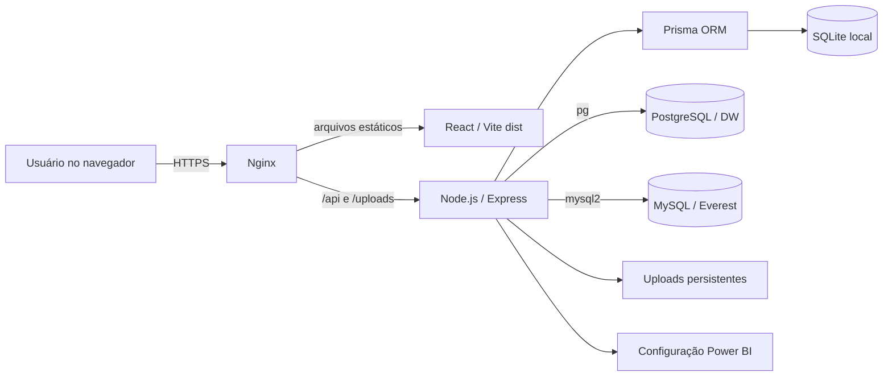
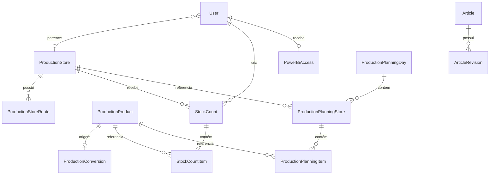

# FAQ EB — Documentação do Sistema

> Documento técnico e funcional baseado no estado da branch `main` em 23/07/2026, commit `91ff6ae`.

## 1. Visão geral

O **FAQ EB** é uma plataforma web interna que começou como uma base de conhecimento e evoluiu para concentrar processos operacionais da empresa.

Atualmente, o sistema reúne:

- base de conhecimento e pesquisa de artigos;
- administração de usuários e permissões;
- incorporação controlada de relatórios Power BI;
- ranking do bolão;
- cadastro operacional de produtos, conversões, lojas e rotas;
- planejamento de produção baseado em vendas, estoque, fixos e encomendas;
- acompanhamento de produção, expedição e divergências;
- contagem de estoque por loja;
- integrações com o Data Warehouse e com o Everest.

O projeto é um monorepo simples, com frontend e backend separados:

```text
FAQ-Emp-rio-Brownie/
├── backend/                  # API, regras de negócio, Prisma e integrações
├── frontend/                 # SPA React
├── DOCUMENTACAO_PROJETO.md   # esta documentação
├── README.md
└── package.json              # atalhos para build, testes e desenvolvimento
```

## 2. Perfis e permissões

O sistema possui cinco perfis internos:

| Perfil | Nome exibido | Principais acessos |
| --- | --- | --- |
| `reader` | Leitor | Base de conhecimento, artigos, recursos gerais habilitados |
| `creator` | Criador | Acessos do Leitor e gestão de artigos |
| `store` | Loja | Base de conhecimento e contagem exclusivamente da loja vinculada |
| `production_manager` | Gerente de produção | Planejamento, produção, expedição e contagens de todas as lojas |
| `admin` | Administrador | Acesso completo, usuários, configurações e integrações |

Regras importantes:

- todo usuário Loja deve estar vinculado a exatamente uma `ProductionStore`;
- Administrador e Gerente de produção podem consultar contagens de todas as lojas;
- somente Administrador altera produtos, conversões, lojas, rotas e conexões externas;
- Administrador e Gerente de produção criam e operam planejamentos;
- Criador e Administrador gerenciam artigos;
- usuários inativos não podem iniciar nem manter uma sessão válida.

## 3. Funcionalidades

### 3.1. Autenticação e perfil

- login por e-mail e senha;
- sessão JWT com validade de sete dias;
- JWT armazenado em cookie HTTP-only;
- logout com remoção do cookie;
- validação do usuário ativo em cada requisição autenticada;
- edição do próprio nome, e-mail, senha e foto;
- redirecionamento para o login quando a sessão expira.

### 3.2. Base de conhecimento

- pesquisa por título, resumo, autor, categoria e conteúdo;
- categorias configuradas com nome, slug, ícone, ordem e situação;
- listagem de artigos recentes;
- artigos publicados e rascunhos;
- editor rico baseado em Quill;
- sanitização do HTML com DOMPurify antes da exibição;
- histórico de revisões;
- importação de documentos `.docx` com conversão para HTML;
- extração das imagens incorporadas no Word;
- upload de imagens para artigos e perfis.

Categorias iniciais:

- Operação;
- Gente & Gestão;
- TI;
- Controladoria & Financeiro;
- Comercial;
- Marketing;
- Produção e Expedição.

### 3.3. Power BI

- dashboard incorporado por `iframe`;
- tela ocupa toda a área útil disponível;
- recurso pode ser habilitado ou desabilitado;
- URL configurável pelo Administrador;
- autorização individual para usuários ativos;
- item do menu exibido somente quando o recurso está ativo e o usuário possui acesso.

### 3.4. Ranking do bolão

- participantes independentes dos usuários do sistema;
- nome, foto e pontuação;
- ordenação por maior pontuação e, em seguida, por nome;
- participantes empatados compartilham a colocação;
- recurso pode ser habilitado ou ocultado;
- cadastro, edição e exclusão restritos ao Administrador.

### 3.5. Cadastros do planejamento

#### Produtos

- código único, nome e situação ativo/inativo;
- importação por planilha;
- ordenação alfabética nas telas;
- flag **“Mostrar na contagem?”**;
- produtos existentes e novos começam marcados por padrão;
- desmarcar a flag afeta somente novas contagens, não remove o produto dos demais módulos;
- importações preservam a configuração da flag de produtos já existentes.

#### Conversões

- uma conversão ativa por produto de origem;
- código e nome do produto convertido;
- fator positivo com até quatro casas decimais;
- proteção contra autorreferência, cadeias de conversão e destinos inconsistentes;
- aplicação sobre vendas, estoque, fixos e encomendas;
- várias origens podem contribuir para o mesmo produto final.

#### Lojas

- código e nome vindos da origem externa;
- nome de exibição utilizado no FAQ;
- situação ativo/inativo;
- sincronização com as lojas encontradas no DW;
- rotas semanais configuráveis de domingo a sábado.

#### Conexões externas

- configuração separada para DW e Everest;
- teste obrigatório antes de salvar;
- token de validação vinculado ao usuário e à configuração testada, válido por cinco minutos;
- senha nunca é devolvida pela API;
- salvamento seguro das variáveis no `.env`;
- renovação dos pools após alteração;
- diagnóstico do Everest disponível para download.

### 3.6. Planejamento de produção

O planejamento cruza vendas históricas, calendário de rotas, estoque, fixos, encomendas e conversões.

#### Criação

O usuário informa:

- período de comparação;
- uma ou mais datas de produção;
- lojas atendidas em cada data;
- origem única do estoque para o planejamento;
- percentual padrão ou percentual por produto.

O período comparado deve conter um dia da semana correspondente a cada data de produção. As lojas também precisam possuir rota ativa no dia escolhido.

#### Fontes de estoque

Existem três fontes:

1. **Estoque Everest** — padrão e comportamento retrocompatível quando `stockSource` não é informado.
2. **Último estoque do FAQ** — usa a contagem finalizada mais recente de cada loja.
3. **Importar estoque** — aceita TXT, XLS e XLSX após validação.

Regras comuns:

- lojas e produtos ausentes recebem estoque zero com aviso;
- lojas do arquivo que não participam do planejamento são ignoradas;
- datas antigas são permitidas e informadas ao usuário;
- conversões combinam o saldo direto do destino com os saldos das origens multiplicados pelos fatores;
- produtos ocultos da contagem recebem zero sem aviso falso de ausência;
- o snapshot guarda quantidade, data, situação, motivo, origem e composição da conversão;
- ao editar ou recalcular um planejamento existente, o snapshot salvo é preservado e nenhuma fonte nova é consultada.

Formato XLS/XLSX de estoque:

| Coluna obrigatória | Significado |
| --- | --- |
| `Fantasia` | Loja |
| `Data Base` | Data do estoque |
| `Item` | Código do produto |
| `Q. Saldo` | Quantidade não negativa, até quatro casas |

O modelo TXT é posicional e espera as colunas `Fantasia`, `Item`, `Descrição Item`, `UM`, `Q. Saldo` e `Situação`. Linhas inativas são ignoradas.

#### Vendas e sugestão

As vendas são consultadas no PostgreSQL/DW nas tabelas `dw.vendas` e `dw.produtos`. Entram no cálculo itens `PRODUCT` e `CANADD`, excluindo vendas canceladas.

As vendas das origens são convertidas e agregadas no produto final. A fórmula aplicada por produto e loja é:

```text
A ser enviado =
  máx(0, média vendida com aumento + fixos + encomendas - estoque disponível)
```

Os resultados gerados pelo sistema são arredondados para no máximo quatro casas decimais.

#### Fixos e encomendas

- importação por XLS/XLSX;
- colunas obrigatórias: `Entrega`, `Q. Embalagem`, `Natureza Fiscal`, `Item` e `Descrição Item`;
- somente naturezas reconhecidas como Fixo ou Encomenda entram no cálculo;
- a data de entrega pode ser diferente da data atual;
- uma tela de validação mostra valores adicionados, acumulado atual e total após confirmação;
- múltiplas importações são acumuladas por produto;
- importar novamente o mesmo arquivo soma novamente;
- produtos novos podem ser cadastrados durante o fluxo;
- as composições ficam registradas em `fixedOrderSources`;
- a consulta complementar de estoque respeita a fonte escolhida no planejamento.

#### Persistência e edição

- existe no máximo um planejamento por data;
- o planejamento grava lojas, produtos e todos os valores calculados;
- edição usa controle otimista por `updatedAt`, evitando sobrescrever alterações concorrentes;
- planejamentos finalizados são imutáveis;
- alterações relevantes limpam marcações anteriores de despacho;
- valores decimais enviados à API com mais de quatro casas são rejeitados com HTTP 400.

### 3.7. Produção e expedição

Estados do planejamento:

```text
nao_iniciado → em_producao → finalizado
```

- o cronômetro começa uma única vez ao clicar em **Iniciar**;
- não existe pausa ou reinício;
- o servidor é a fonte oficial dos horários;
- a interface atualiza `HH:mm:ss` localmente, sem requisições a cada segundo;
- a finalização congela a duração;
- produções antigas sem medição confiável exibem `—`.

No despacho:

- somente produtos com **A ser enviado** maior que zero aparecem;
- é possível marcar cada item como Produzido;
- **Selecionar todos** marca todos os produtos despacháveis da loja;
- divergências exigem quantidade real inteira e justificativa;
- todos os produtos precisam estar marcados antes da finalização;
- depois de finalizar, a expedição não pode mais ser alterada.

A aba **Consolidado** exibe uma matriz:

```text
Código | Produto | Loja 1 | Loja 2 | ... | Total geral
```

- lojas e produtos em ordem alfabética;
- zero quando o produto não existe em determinada loja;
- Código e Produto fixos durante a rolagem horizontal;
- exportação Excel no mesmo formato consolidado;
- abas individuais preservam a exportação detalhada por loja.

### 3.8. Contagem de estoque

- acessível para Loja, Gerente de produção e Administrador;
- usuário Loja acessa somente sua unidade;
- data definida pelo servidor em `America/Fortaleza`;
- snapshot dos produtos ativos marcados com `showInStockCount`;
- origem e destino das conversões aparecem como itens independentes quando ambos estão marcados;
- produtos ordenados alfabeticamente;
- rascunho com autosave;
- Enter salva e avança para a próxima linha;
- quantidades não negativas, com vírgula ou ponto e no máximo quatro casas;
- campos vazios viram zero ao finalizar;
- contagens finalizadas são imutáveis;
- várias contagens podem ser finalizadas para a mesma loja no mesmo dia;
- enquanto existe um rascunho no dia, **Nova contagem** retoma esse rascunho;
- depois da finalização, outra contagem pode ser iniciada;
- a listagem mostra data e horário para distinguir contagens do mesmo dia;
- o planejamento usa somente a contagem finalizada mais recente e ignora rascunhos.

## 4. Arquitetura



### Frontend

- React 18;
- Vite 5;
- React Router DOM 6;
- Axios;
- React Quill e Quill Image Resize;
- DOMPurify;
- Emoji Picker React;
- SheetJS carregado de `frontend/public/vendor/xlsx.full.min.js`;
- CSS global em `frontend/src/index.css`;
- SPA com carregamento sob demanda das páginas.

### Backend

- Node.js;
- Express 4;
- Prisma ORM 5;
- SQLite como banco principal;
- PostgreSQL via `pg` para vendas do DW;
- MySQL via `mysql2` para estoque Everest;
- JWT, cookie-parser e bcryptjs;
- Multer para uploads;
- Mammoth para importação Word.

### Fluxo HTTP

- frontend usa `/api` por padrão;
- em desenvolvimento, Vite encaminha `/api` e `/uploads` para `localhost:4000`;
- em produção, Nginx entrega o build e encaminha essas rotas para o Express;
- `GET /api/health` retorna `{"ok":true}`.

## 5. Estrutura do banco principal

O banco operacional é SQLite, configurado por `DATABASE_URL` e versionado por migrations Prisma.



### Modelos

| Modelo | Finalidade e campos relevantes |
| --- | --- |
| `User` | Credenciais, perfil, situação, papel e loja vinculada |
| `Category` | Categorias da base, slug, ícone, ordem e situação |
| `Article` | Artigo, HTML, resumo, categoria, tags, autor, status e ordenação |
| `ArticleRevision` | Snapshot histórico de cada alteração de artigo |
| `PoolParticipant` | Participante, foto e pontuação |
| `AppSettings` | Flags globais do Bolão e Power BI, além da URL do BI |
| `PowerBiAccess` | Relação um-para-um dos usuários autorizados ao BI |
| `ProductionProduct` | Produto operacional, situação e flag da contagem |
| `ProductionConversion` | Origem, destino e fator de conversão |
| `ProductionStore` | Loja externa, nome de exibição e situação |
| `ProductionStoreRoute` | Dias da semana atendidos pela loja |
| `StockCount` | Cabeçalho, loja, data, status, criador e finalização |
| `StockCountItem` | Snapshot do produto e quantidade contada |
| `ProductionPlanningDay` | Data, comparação, status e horários do cronômetro |
| `ProductionPlanningStore` | Loja e percentual padrão dentro do planejamento |
| `ProductionPlanningItem` | Snapshot completo de venda, estoque, adicionais, sugestão e despacho |

### Snapshots e campos JSON

Alguns dados são armazenados como texto JSON para preservar a composição original:

- `servedDates`: datas efetivamente usadas no cálculo de vendas;
- `fixedOrderSources`: linhas e conversões de Fixos/Encomendas;
- `stockSources`: saldos direto e convertidos que compõem o estoque.

Essa estratégia permite visualizar e recalcular um planejamento salvo sem depender do estado atual das integrações.

### Exclusões e integridade

- revisões são apagadas em cascata com o artigo;
- acessos ao BI são apagados em cascata com o usuário;
- itens da contagem são apagados em cascata com a contagem;
- lojas e produtos referenciados possuem restrições para proteger históricos;
- produtos são inativados em vez de removidos quando precisam continuar referenciados.

## 6. Bancos e integrações externas

| Sistema | Tecnologia | Uso |
| --- | --- | --- |
| Banco principal | SQLite | Usuários, conteúdo, configurações, cadastros, planejamentos e contagens |
| DW | PostgreSQL | Lojas e histórico de vendas |
| Everest | MySQL | Saldos de estoque |
| Power BI | URL de incorporação | Relatório disponibilizado dentro da aplicação |

As credenciais externas ficam no `.env` do backend e não no SQLite. A API administrativa retorna somente metadados seguros e se a senha está configurada.

## 7. Rotas do frontend

| Rota | Acesso |
| --- | --- |
| `/login` | Público |
| `/` | Autenticado |
| `/categoria/:slug` | Autenticado |
| `/artigo/:slug` | Autenticado |
| `/power-bi` | Autenticado e autorizado ao BI |
| `/ranking-bolao` | Autenticado, se habilitado |
| `/planejamento-producao` | Administrador ou Gerente de produção |
| `/planejamento-producao/nova` | Administrador ou Gerente de produção |
| `/planejamento-producao/:day/editar` | Administrador ou Gerente de produção |
| `/planejamento-producao/configuracoes` | Administrador |
| `/contagem-estoque` | Loja, Administrador ou Gerente de produção |
| `/contagem-estoque/:id` | Loja da contagem, Administrador ou Gerente |
| `/admin/dashboard` | Criador ou Administrador |
| `/admin/artigos/novo` | Criador ou Administrador |
| `/admin/artigos/:id/editar` | Criador ou Administrador |
| `/admin/bolao` | Administrador |
| `/admin/configuracoes` | Administrador |

## 8. API

Base local: `http://localhost:4000/api`.

### Autenticação

- `GET /health`
- `POST /auth/login`
- `POST /auth/logout`
- `GET /auth/me`

### Conhecimento e recursos gerais

- `GET /knowledge/articles`
- `GET /knowledge/articles/id/:id`
- `GET /knowledge/articles/:slug`
- `GET /knowledge/categories`
- `GET /knowledge/pool-ranking`
- `GET /knowledge/pool-settings`
- `GET /knowledge/power-bi-config`

### Administração de conteúdo e usuários

- `PUT /admin/users/me`
- `POST /admin/uploads`
- `POST /admin/articles/import-word`
- `POST /admin/articles`
- `PUT /admin/articles/:id`
- `DELETE /admin/articles/:id`
- `GET /admin/articles/:id/revisions`
- `POST /admin/users`
- `GET /admin/users`
- `PUT /admin/users/:id`

### Bolão e Power BI

- `POST /admin/pool-participants`
- `PUT /admin/pool-participants/:id`
- `DELETE /admin/pool-participants/:id`
- `PUT /admin/pool-settings`
- `GET /admin/power-bi-settings`
- `PUT /admin/power-bi-settings`

### Configuração operacional

- `GET|PUT /admin/production-products`
- `GET /admin/production-products/planning`
- `POST /admin/production-products`
- `GET|PUT /admin/production-conversions`
- `GET|PUT /admin/production-stores`
- `GET /admin/production-stores/planning`
- `POST /admin/production-stores/sync`
- `PUT /admin/production-store-routes`
- `GET /admin/database-connections`
- `POST /admin/database-connections/:system/test`
- `PUT /admin/database-connections/:system`
- `GET /admin/database-connections/everest/diagnostic`

### Planejamento e expedição

- `POST /admin/production-planning/suggestions`
- `POST /admin/production-planning/stocks`
- `POST /admin/production-planning/conversions/apply`
- `GET|POST /admin/production-planning`
- `GET|PUT /admin/production-planning/:day`
- `PATCH /admin/production-planning/:day/status`
- `PUT /admin/production-planning/:day/dispatch`
- `PUT /admin/production-planning/:day/dispatch/bulk`
- `POST /admin/production-planning/:day/finalize`

### Contagem

- `GET /stock-counts/stores`
- `GET|POST /stock-counts`
- `GET /stock-counts/:id`
- `PATCH /stock-counts/:id/items/:itemId`
- `POST /stock-counts/:id/finalize`

## 9. Arquivos e persistência

- imagens aceitas: JPG, PNG, WEBP e GIF, até 5 MB;
- documentos Word: somente `.docx`, até 10 MB;
- corpo JSON e formulário URL-encoded: até 20 MB;
- uploads ficam em `backend/uploads/`;
- banco SQLite fica em `backend/src/prisma/dev.db` conforme a configuração atual;
- `.env`, bancos, uploads, logs, dependências e builds não são versionados pelo Git.

Em produção, banco, `.env` e uploads precisam ser preservados entre deploys.

## 10. Variáveis de ambiente

Valores reais e senhas não devem ser incluídos em documentação, logs ou commits.

### Backend

| Variável | Uso |
| --- | --- |
| `DATABASE_URL` | Caminho/conexão do Prisma |
| `PORT` | Porta HTTP do Express |
| `CLIENT_ORIGIN` | Origens CORS, separadas por vírgula |
| `JWT_SECRET` | Assinatura dos tokens |
| `NODE_ENV` | Ativa cookies seguros em produção |
| `TRUST_PROXY` | Confiança no proxy reverso |
| `COOKIE_SAMESITE` | Política SameSite do cookie |
| `DW_DB_HOST`, `DW_DB_PORT`, `DW_DB_NAME`, `DW_DB_USER`, `DW_DB_PASSWORD` | PostgreSQL/DW |
| `EVEREST_DB_ENABLED` | Habilita a consulta Everest |
| `EVEREST_DB_HOST`, `EVEREST_DB_PORT`, `EVEREST_DB_NAME`, `EVEREST_DB_USER`, `EVEREST_DB_PASSWORD` | MySQL/Everest |
| `EVEREST_DB_CHARSET` | Charset da conexão Everest |
| `EVEREST_STOCK_TIMEZONE` | Fuso da data-base do estoque |
| `EVEREST_STOCK_DEBUG` | Diagnóstico adicional, sem uso rotineiro |

### Frontend

| Variável | Uso |
| --- | --- |
| `VITE_API_URL` | URL da API; por padrão, `/api` |

## 11. Desenvolvimento local

Requisitos:

- Node.js e npm;
- acesso aos bancos externos quando os fluxos integrados forem testados.

### Instalação e banco

```bash
cd backend
npm install
npx prisma migrate deploy --schema src/prisma/schema.prisma
npm run prisma:generate
```

### Execução

Terminal 1:

```bash
cd backend
npm run dev
```

Terminal 2:

```bash
cd frontend
npm install
npm run dev
```

Endereços padrão:

- frontend: `http://localhost:5173`;
- backend: `http://localhost:4000`;
- health check: `http://localhost:4000/api/health`.

## 12. Testes e validações

```bash
# Raiz
npm test
npm run build

# Ou separadamente
cd backend
npm test
npx prisma validate --schema src/prisma/schema.prisma
npx prisma migrate status --schema src/prisma/schema.prisma

cd ../frontend
npm run build

cd ..
git diff --check
```

Na data deste documento, a suíte possui **38 testes** e cobre, entre outros:

- autenticação e permissões;
- conexões externas sem exposição de senhas;
- validação decimal;
- conversões de vendas, encomendas e estoque;
- fontes Everest, FAQ e planilha;
- persistência e concorrência de planejamentos;
- cronômetro e transições de status;
- despacho;
- seleção e imutabilidade das contagens;
- múltiplas contagens por loja no mesmo dia.

## 13. Hospedagem atual

Estado verificado em 23/07/2026:

| Item | Configuração |
| --- | --- |
| Provedor/servidor | VPS Linux acessível pelo host `177.126.247.194` |
| Sistema operacional | Ubuntu 24.04.4 LTS |
| Domínio | `https://faq.emporiobrownie.com.br` |
| Diretório | `/var/www/FAQ-Emp-rio-Brownie-master` |
| Branch de produção | `main` |
| Proxy/estáticos | Nginx 1.24 |
| TLS | Let's Encrypt |
| Backend | Node.js 24, porta local 4000 |
| Process manager | PM2, processo `faq-backend`, modo fork |
| Frontend | arquivos de `frontend/dist` servidos pelo Nginx |
| Banco principal | SQLite local persistente |

Fluxo:

1. Nginx redireciona HTTP para HTTPS no domínio.
2. `/` entrega a SPA e usa fallback para `index.html`.
3. `/api/` é encaminhado para `127.0.0.1:4000/api/`.
4. `/uploads/` é encaminhado para o backend.
5. PM2 mantém o backend ativo e inicia com o sistema por `pm2-root`.

## 14. Processo de deploy

O deploy é manual, por SSH, sempre a partir da `main`.

Procedimento recomendado:

```bash
cd /var/www/FAQ-Emp-rio-Brownie-master

# 1. Confirmar que não existem alterações rastreadas inesperadas
git status --short

# 2. Criar backup único do SQLite
mkdir -p backups
cp backend/src/prisma/dev.db backups/dev.db.pre-deploy-AAAAMMDD-HHMMSS

# 3. Atualizar somente por fast-forward
git pull --ff-only origin main

# 4. Backend e migrations
cd backend
npm install
npx prisma migrate deploy --schema src/prisma/schema.prisma
npx prisma generate --schema src/prisma/schema.prisma

# 5. Frontend
cd ../frontend
npm install
npm run build

# 6. Reiniciar e persistir o PM2
cd ..
pm2 restart faq-backend
pm2 save
```

Validação pós-deploy:

```bash
cd /var/www/FAQ-Emp-rio-Brownie-master
git rev-parse --short HEAD
git status --short --untracked-files=no

cd backend
npx prisma migrate status --schema src/prisma/schema.prisma
curl --fail http://127.0.0.1:4000/api/health
pm2 status faq-backend
```

Nunca executar limpeza, reset ou checkout amplo no servidor: `.env`, SQLite, uploads e backups são dados persistentes fora do Git.

## 15. Segurança

- senhas armazenadas com bcrypt;
- JWT assinado com segredo obrigatório;
- cookie HTTP-only, `secure` em produção e SameSite configurável;
- CORS por lista de origens;
- autorização no backend, além da proteção visual do frontend;
- usuário ativo consultado a cada requisição;
- HTML de artigos sanitizado;
- validação de MIME, extensão e tamanho dos uploads;
- conexões externas sem múltiplas instruções SQL no MySQL;
- erros de banco convertidos em mensagens seguras;
- credenciais externas nunca retornadas integralmente;
- `.env`, SQLite e uploads ignorados pelo Git.

## 16. Pontos de atenção e manutenção

- SQLite atende a instância única atual; múltiplas instâncias ou alta concorrência exigiriam avaliar PostgreSQL.
- Não foi identificada uma política automática de backup do SQLite e dos uploads; o backup pré-deploy não substitui backup periódico externo.
- O virtual host HTTPS não define explicitamente `client_max_body_size`; o padrão do Nginx pode bloquear arquivos antes dos limites de 5/10 MB da aplicação.
- Dependências devem ser auditadas e atualizadas em uma mudança planejada, com testes completos.
- O chunk do Quill é grande; se o desempenho inicial se tornar um problema, pode ser dividido ou carregado ainda mais tarde.
- Parte dos arquivos antigos apresenta sinais de encoding incorreto quando lida em alguns terminais; novos arquivos devem permanecer em UTF-8.
- A pasta `backend/uploads/`, o banco SQLite e os arquivos `.env` precisam entrar em qualquer plano de migração de servidor.
- Toda migration nova deve ser publicada junto ao código e aplicada com `prisma migrate deploy`.

## 17. Referências internas

- Schema: `backend/src/prisma/schema.prisma`
- Migrations: `backend/src/prisma/migrations/`
- Inicialização da API: `backend/src/app.js` e `backend/src/server.js`
- Rotas: `backend/src/routes/`
- Regras de planejamento: `backend/src/controllers/productionPlanningController.js`
- Persistência e expedição: `backend/src/controllers/productionPlanningPersistenceController.js`
- Contagem: `backend/src/controllers/stockCountController.js`
- Integrações: `backend/src/services/`
- Rotas da SPA: `frontend/src/App.jsx`
- Planejamento: `frontend/src/pages/NewProductionPlanning.jsx`
- Produção/expedição: `frontend/src/pages/ProductionPlanning.jsx`
- Contagem: `frontend/src/pages/StockCounts.jsx` e `StockCountEntry.jsx`
- Estilos: `frontend/src/index.css`
